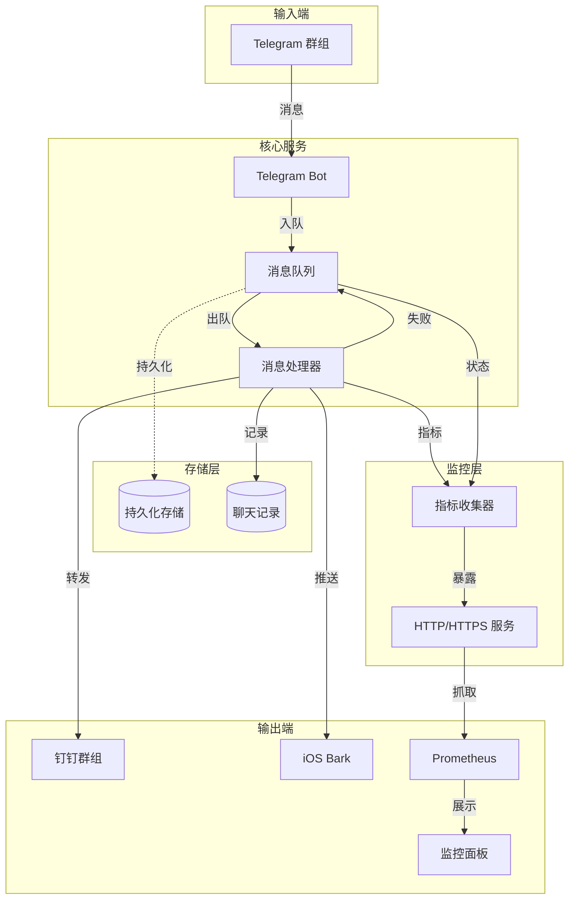
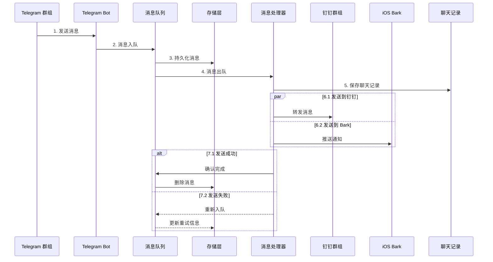
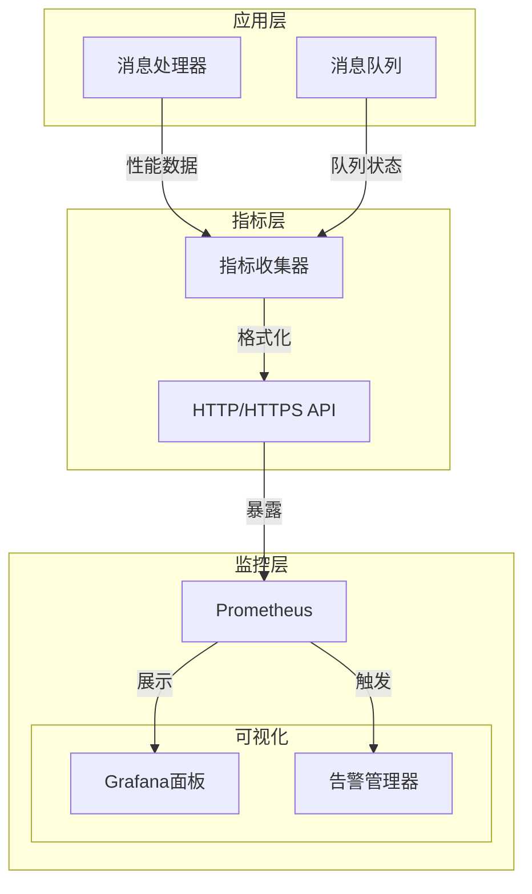

# Telegram 转发到钉钉和 Bark


一个用 Golang 实现的应用程序，用于将 Telegram 群聊消息转发到钉钉机器人和 iOS Bark 应用。

**当前版本：v2.0.0**

## 功能特点

- 监听指定的 Telegram 群聊消息
- 支持多个通知目标：
  - 钉钉机器人
  - iOS Bark 应用
- 处理网络超时和错误情况
- 支持消息重试机制
- 支持持久化存储失败消息，程序重启后不会丢失
- 支持 systemd 和 SysV init 服务管理
- 支持 RPM 和 DEB 包安装
- 支持队列指标收集，便于对接 Prometheus 监控
- 提供 HTTP 接口暴露队列指标数据

## 系统架构

### 整体架构



### 消息处理流程



### 指标收集架构



### 组件说明

1. **Telegram Bot**
   - 监听指定群组的消息
   - 支持多群组同时监听
   - 处理消息格式转换

2. **消息队列**
   - 支持内存队列和 LevelDB 持久化
   - 确保消息不丢失
   - 管理消息重试机制

3. **消息处理器**
   - 转发消息到钉钉
   - 推送通知到 Bark
   - 处理网络异常
   - 管理重试策略
   - 收集性能指标

4. **通知客户端**
   - **钉钉机器人**
     - 支持自定义 Webhook
     - 支持签名验证
     - 支持 @ 功能
   - **Bark 客户端**
     - 支持多设备推送
     - 自定义通知声音
     - 自定义通知图标
     - 按聊天分组通知

5. **存储系统**
   - **消息队列存储**
     - 使用 LevelDB 存储消息
     - 保证程序重启后恢复
     - 管理消息生命周期
   - **聊天记录存储**
     - 保存历史消息
     - 支持按时间查询
     - 支持按用户查询

6. **指标系统**
   - 收集队列状态
   - 监控系统性能
   - 支持 HTTP/HTTPS 访问
   - 提供认证机制
   - 对接 Prometheus

### 安全机制

1. **认证**
   - API Key 认证
   - 可配置的请求头
   - HTTPS 支持

2. **权限控制**
   - 最小权限原则
   - 文件权限管理
   - 用户隔离

3. **数据保护**
   - 消息持久化
   - 错误恢复
   - 安全传输

## 配置说明

配置文件使用 YAML 格式，默认路径为 `/etc/tg-forward/config.yaml`。主要配置项包括：

```yaml
telegram:
  token: "YOUR_BOT_TOKEN"
  chat_ids: [123456789]  # 要监听的群组 ID

dingtalk:
  webhook_url: "https://oapi.dingtalk.com/robot/send?access_token=xxx"
  secret: "YOUR_SECRET"
  enable_at: true
  at_mobiles: ["13800138000"]
  is_at_all: false
  notify_verbose: true

bark:
  enabled: true
  keys: ["YOUR_BARK_KEY1", "YOUR_BARK_KEY2"]
  sound: "minuet"
  icon: "https://example.com/icon.jpg"

queue:
  type: "leveldb"  # 可选: memory, leveldb
  path: "/var/lib/tg-forward/queue"

log:
  level: "info"
  file_path: "/var/log/tg-forward/app.log"
  max_size: 100  # MB
  max_files: 10

metrics:
  enabled: true
  interval: 60
  output_file: "/var/lib/tg-forward/metrics.json"
  http:
    enabled: true
    port: 9090
    path: "/metrics"
    auth: true
    api_key: "YOUR_API_KEY"
```

## 安装说明

### 使用包管理器安装

#### RPM 包 (CentOS/RHEL/Fedora)

```bash
sudo rpm -ivh tg-forward-2.0.0-1.el8.x86_64.rpm
sudo vi /etc/tg-forward/config.yaml
sudo systemctl start tg-forward
```

#### DEB 包 (Debian/Ubuntu)

```bash
sudo dpkg -i tg-forward_2.0.0-1_amd64.deb
sudo vi /etc/tg-forward/config.yaml
sudo systemctl start tg-forward
```

### 从源码构建

```bash
git clone https://github.com/user/tg-forward-to-xx.git
cd tg-forward-to-xx
make build
sudo make install
```

### 使用 Docker

```bash
docker build -t tg-forward-to-xx .
docker run -v $(pwd)/config:/etc/tg-forward \
          -v $(pwd)/data:/var/lib/tg-forward \
          -v $(pwd)/logs:/var/log/tg-forward \
          tg-forward-to-xx
```

## 使用说明

1. 配置 Telegram Bot
   - 从 @BotFather 获取 bot token
   - 将 bot 添加到目标群组
   - 获取群组 ID

2. 配置钉钉机器人
   - 创建钉钉群机器人
   - 获取 Webhook URL 和签名密钥
   - 配置安全设置

3. 配置 Bark 通知
   - 在 iOS 设备上安装 Bark 应用
   - 获取设备推送密钥
   - 配置推送设置

4. 启动服务
   ```bash
   sudo systemctl start tg-forward
   sudo systemctl enable tg-forward  # 设置开机自启
   ```

5. 查看日志
   ```bash
   sudo journalctl -u tg-forward -f
   ```

## 常见问题

1. 消息队列问题
   - 检查目录权限
   - 确保磁盘空间充足
   - 查看日志文件

2. 网络连接问题
   - 检查网络连接
   - 确认防火墙设置
   - 验证代理配置

3. 权限问题
   - 检查配置文件权限
   - 确认运行用户权限
   - 验证目录访问权限

## 贡献指南

1. Fork 项目
2. 创建特性分支
3. 提交变更
4. 推送到分支
5. 创建 Pull Request

## 许可证

MIT License