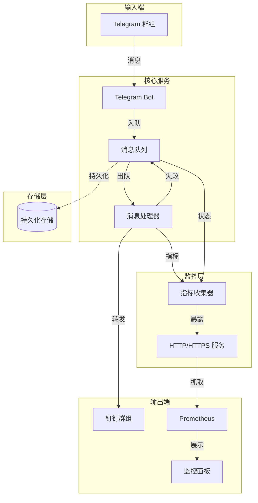
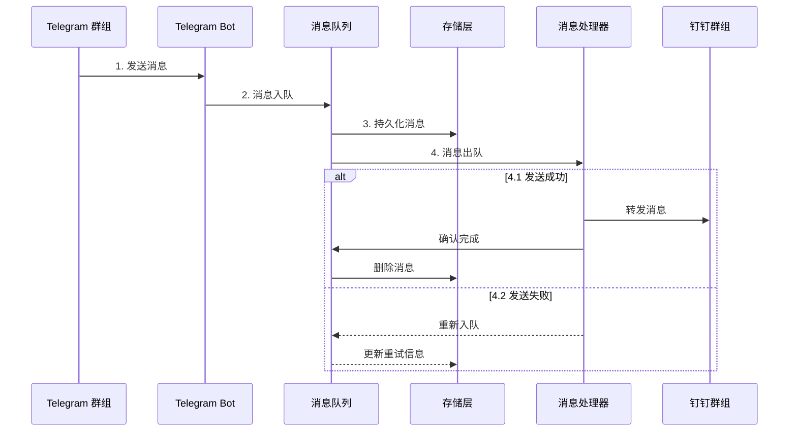
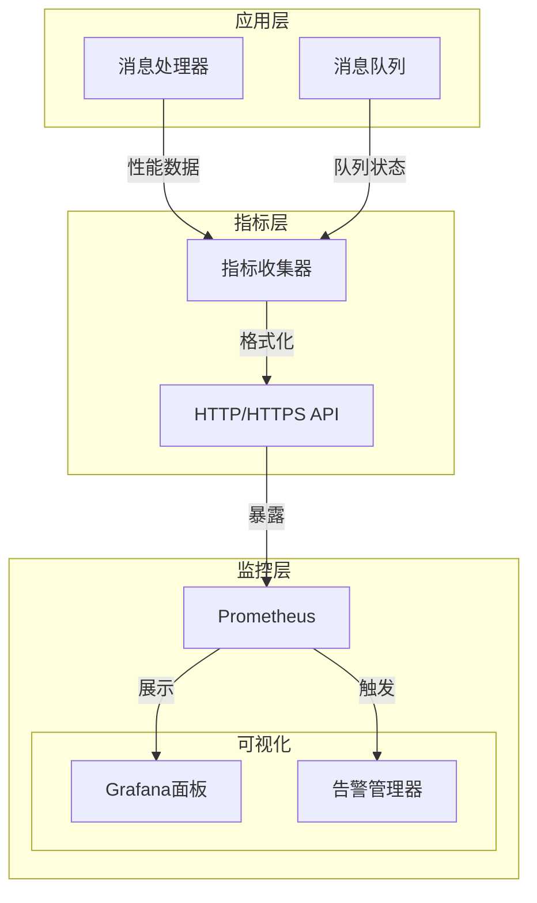

# Telegram 转发到钉钉


一个用 Golang 实现的应用程序，用于将 Telegram 群聊消息转发到钉钉机器人。

**当前版本：v1.0.4**

## 功能特点

- 监听指定的 Telegram 群聊消息
- 将消息转发到钉钉机器人
- 处理网络超时和错误情况
- 支持消息重试机制
- 支持持久化存储失败消息，程序重启后不会丢失
- 支持 systemd 和 SysV init 服务管理
- 支持 RPM 和 DEB 包安装
- 支持队列指标收集，便于对接 Prometheus 监控
- 提供 HTTP 接口暴露队列指标数据

## 系统架构

### 整体架构



### 消息处理流程



### 指标收集架构



### 组件说明

1. **Telegram Bot**
   - 监听指定群组的消息
   - 支持多群组同时监听
   - 处理消息格式转换

2. **消息队列**
   - 支持内存队列和 LevelDB 持久化
   - 确保消息不丢失
   - 管理消息重试机制

3. **消息处理器**
   - 转发消息到钉钉
   - 处理网络异常
   - 管理重试策略
   - 收集性能指标

4. **指标系统**
   - 收集队列状态
   - 监控系统性能
   - 支持 HTTP/HTTPS 访问
   - 提供认证机制
   - 对接 Prometheus

5. **持久化存储**
   - 使用 LevelDB 存储消息
   - 保证程序重启后恢复
   - 管理消息生命周期

### 安全机制

1. **认证**
   - API Key 认证
   - 可配置的请求头
   - HTTPS 支持

2. **权限控制**
   - 最小权限原则
   - 文件权限管理
   - 用户隔离

3. **数据保护**
   - 消息持久化
   - 错误恢复
   - 安全传输

## 安装

### 使用 Makefile 安装

项目提供了 Makefile 简化构建和安装过程：

```bash
# 构建应用
make build

# 安装到系统
sudo make install

# 卸载
sudo make uninstall

# 查看所有可用命令
make help
```

### 使用 RPM 包安装 (CentOS/RHEL/Fedora)

```bash
# 安装 RPM 包
sudo rpm -ivh tg-forward-1.0.4-1.el8.x86_64.rpm

# 编辑配置文件
sudo vi /etc/tg-forward/config.yaml

# 启动服务
sudo systemctl start tg-forward
```

### 使用 DEB 包安装 (Debian/Ubuntu)

```bash
# 安装 DEB 包
sudo dpkg -i tg-forward_1.0.4-1_amd64.deb

# 编辑配置文件
sudo vi /etc/tg-forward/config.yaml

# 启动服务
sudo systemctl start tg-forward
```

### 从源码构建

```bash
git clone https://github.com/user/tg-forward-to-xx.git
cd tg-forward-to-xx
go build -o tg-forward cmd/tgforward/main.go
```

### 使用 Docker

```bash
docker build -t tg-forward-to-xx .
docker run -v $(pwd)/config:/app/config -v $(pwd)/data:/app/data tg-forward-to-xx
```

## 配置

配置文件默认路径为 `/etc/tg-forward/config.yaml`。程序按以下顺序查找配置文件：

1. 命令行参数指定的路径（`-config` 参数）
2. 环境变量 `TG_FORWARD_CONFIG` 指定的路径
3. 当前目录下的 `config.yaml`
4. 默认路径 `/etc/tg-forward/config.yaml`

安装包（RPM/DEB）会自动：
- 创建配置目录 `/etc/tg-forward`
- 安装默认配置文件到 `/etc/tg-forward/config.yaml`
- 设置适当的文件权限（640）和所有权（root:tgforward）
- 在 systemd/init.d 服务中使用此默认路径

配置文件示例：

```yaml
telegram:
  token: "YOUR_TELEGRAM_BOT_TOKEN"
  chat_ids: [123456789, -987654321]  # 要监听的聊天ID列表

dingtalk:
  webhook_url: "https://oapi.dingtalk.com/robot/send?access_token=YOUR_ACCESS_TOKEN"
  secret: "YOUR_SECRET"  # 钉钉机器人安全设置中的签名密钥

queue:
  type: "leveldb"  # 可选: "memory" 或 "leveldb"
  path: "./data/queue"  # LevelDB 存储路径

retry:
  max_attempts: 5  # 最大重试次数
  interval: 60  # 重试间隔（秒）

metrics:
  enabled: true  # 是否启用指标收集
  interval: 60   # 收集间隔（秒）
  output_file: "./data/metrics/queue_metrics.json"  # 指标输出文件路径
  http:
    enabled: true   # 是否启用 HTTP 服务
    port: 9090      # HTTP 服务端口
    path: "/metrics"  # 指标 API 路径
    auth: true      # 是否启用认证
    api_key: "your-secret-api-key"  # API Key
    header_name: "X-API-Key"  # API Key 请求头名称
    tls:
      enabled: true                    # 是否启用 HTTPS
      cert_file: "./certs/server.crt"  # 证书文件路径
      key_file: "./certs/server.key"   # 私钥文件路径
      port: 9443                       # HTTPS 端口（可选）
      force_https: true                # 强制使用 HTTPS
```

### 使用环境变量指定配置文件

可以通过环境变量指定配置文件路径：

```bash
export TG_FORWARD_CONFIG=/path/to/your/config.yaml
./tg-forward
```

或者在运行时指定：

```bash
TG_FORWARD_CONFIG=/path/to/your/config.yaml ./tg-forward
```

### 获取 Telegram Bot Token

1. 在 Telegram 中搜索 [@BotFather](https://t.me/BotFather)
2. 发送 `/newbot` 命令创建一个新机器人
3. 按照提示完成创建，获取 API Token

### 获取 Telegram 聊天 ID

1. 将机器人添加到群组中
2. 发送一条消息到群组
3. 访问 `https://api.telegram.org/bot<YOUR_BOT_TOKEN>/getUpdates`
4. 在返回的 JSON 中找到 `chat` 对象中的 `id` 字段

### 创建钉钉机器人

1. 在钉钉群设置中添加自定义机器人
2. 选择安全设置（推荐使用"加签"）
3. 获取 Webhook URL 和签名密钥

## 使用方法

### 命令行运行

```bash
# 使用默认配置文件
./tg-forward

# 指定配置文件
./tg-forward -config /path/to/config.yaml

# 设置日志级别
./tg-forward -log-level debug
```

### 作为 systemd 服务运行

```bash
# 启动服务
sudo systemctl start tg-forward

# 停止服务
sudo systemctl stop tg-forward

# 查看服务状态
sudo systemctl status tg-forward

# 设置开机自启
sudo systemctl enable tg-forward
```

### 作为 SysV init 服务运行

```bash
# 启动服务
sudo service tg-forward start

# 停止服务
sudo service tg-forward stop

# 查看服务状态
sudo service tg-forward status

# 设置开机自启
sudo chkconfig tg-forward on
```

## 构建安装包

项目提供了构建 RPM 和 DEB 包的脚本：

```bash
# 构建所有包
cd deploy
bash build-packages.sh

# 只构建 RPM 包
bash build-packages.sh --rpm-only

# 只构建 DEB 包
bash build-packages.sh --deb-only

# 不更新版本号
bash build-packages.sh --no-version-update
```

## 日志级别

- `debug`: 详细调试信息
- `info`: 一般信息（默认）
- `warn`: 警告信息
- `error`: 错误信息

## 指标收集

应用程序支持收集队列相关指标，便于监控和对接 Prometheus 等监控系统。

### 指标配置

在 `config.yaml` 中配置指标收集：

```yaml
metrics:
  enabled: true  # 是否启用指标收集
  interval: 60   # 收集间隔（秒）
  output_file: "./data/metrics/queue_metrics.json"  # 指标输出文件路径
  http:
    enabled: true  # 是否启用 HTTP 服务
    port: 9090     # HTTP 服务端口
    path: "/metrics"  # 指标 API 路径
```

### 收集的指标

应用程序每分钟收集以下指标：

#### 基础指标
- `queue_size`: 当前队列中的消息数量
- `processed_messages`: 成功处理的消息数量
- `failed_messages`: 发送失败的消息数量
- `retry_messages`: 重试的消息数量
- `uptime_seconds`: 程序运行时间（秒）
- `last_update_time`: 最后更新时间

#### 性能指标
- `avg_latency_ms`: 消息平均处理延迟（毫秒）
- `p95_latency_ms`: 消息处理延迟的 P95 值（毫秒）
- `throughput_per_min`: 每分钟处理的消息数量
- `success_rate`: 消息处理成功率（百分比）
- `avg_retry_count`: 每条消息的平均重试次数
- `queue_pressure`: 队列积压程度（当前队列大小与处理速率的比值）
- `total_retry_count`: 总重试次数

### HTTP 指标接口

应用程序提供 HTTP/HTTPS 接口，可以通过以下方式访问指标数据：

```
http://your-server:9090/metrics
https://your-server:9443/metrics  # 如果启用了 HTTPS
```

#### HTTPS 配置

为了提供更安全的访问方式，可以启用 HTTPS：

```yaml
metrics:
  http:
    tls:
      enabled: true                    # 启用 HTTPS
      cert_file: "./certs/server.crt"  # 证书文件路径
      key_file: "./certs/server.key"   # 私钥文件路径
      port: 9443                       # HTTPS 端口（可选）
      force_https: true                # 强制使用 HTTPS
```

如果启用了 `force_https`，HTTP 请求将自动重定向到 HTTPS。

生成自签名证书（用于测试）：

```bash
# 生成私钥
openssl genrsa -out server.key 2048

# 生成证书签名请求
openssl req -new -key server.key -out server.csr

# 生成自签名证书
openssl x509 -req -days 365 -in server.csr -signkey server.key -out server.crt
```

在生产环境中，建议使用受信任的 CA 签发的证书。

#### 认证配置

为了保护 HTTP/HTTPS 接口，可以启用 API Key 认证：

```yaml
metrics:
  http:
    auth: true                  # 启用认证
    api_key: "your-secret-key"  # 设置 API Key
    header_name: "X-API-Key"    # 自定义请求头名称（可选）
```

访问接口时需要在请求头中添加 API Key：

```bash
curl -H "X-API-Key: your-secret-key" http://your-server:9090/metrics
```

如果认证失败，服务器将返回 401 Unauthorized 状态码。

#### 返回数据示例

```json
{
  "queue_size": 10,
  "processed_messages": 1000,
  "failed_messages": 5,
  "retry_messages": 15,
  "last_update_time": "2024-01-09T10:00:00Z",
  "uptime_seconds": 3600,
  "avg_latency_ms": 150,
  "p95_latency_ms": 300,
  "throughput_per_min": 60,
  "success_rate": 99.5,
  "avg_retry_count": 0.015,
  "queue_pressure": 0.167,
  "total_retry_count": 15
}
```

## 注意事项

### LevelDB 队列

如果使用 LevelDB 队列类型，请确保：

1. 应用程序对队列目录有足够的读写权限
2. 队列目录所在的磁盘有足够的空间
3. 没有其他进程正在使用同一个 LevelDB 数据库
4. 如果遇到"resource temporarily unavailable"错误，可以尝试：
   - 检查目录权限
   - 确保没有其他实例正在运行
   - 删除队列目录中的 LOCK 文件（确保没有实例在运行的情况下）
   - 切换到内存队列类型（在配置文件中设置 `queue.type: "memory"`）

从 v1.0.5 版本开始，当 LevelDB 队列创建失败时，程序会自动切换到内存队列作为备用方案。