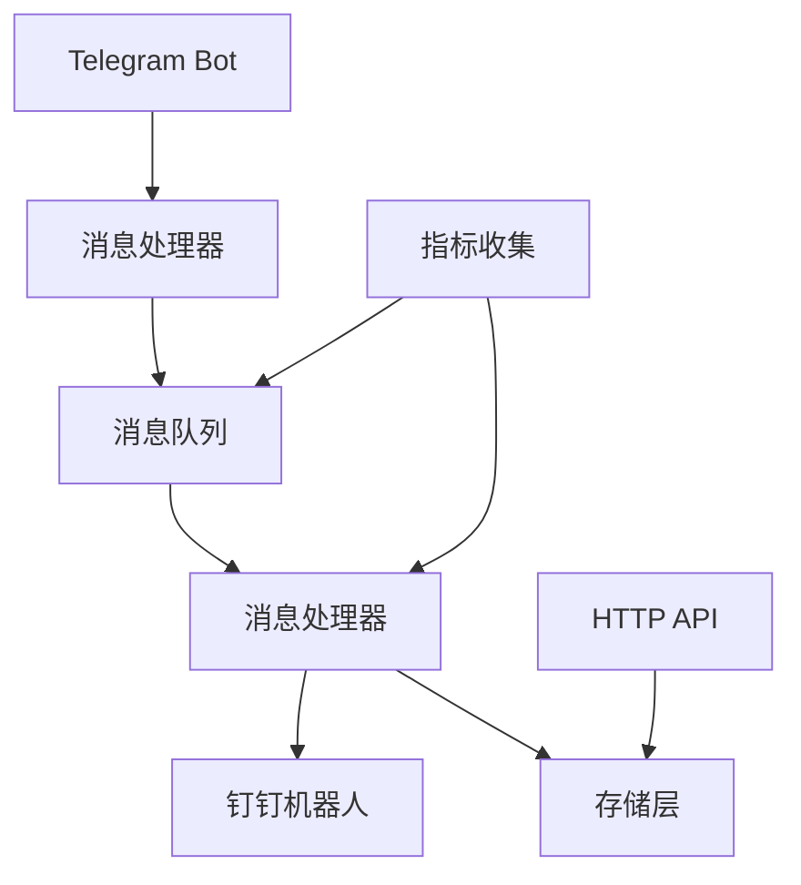
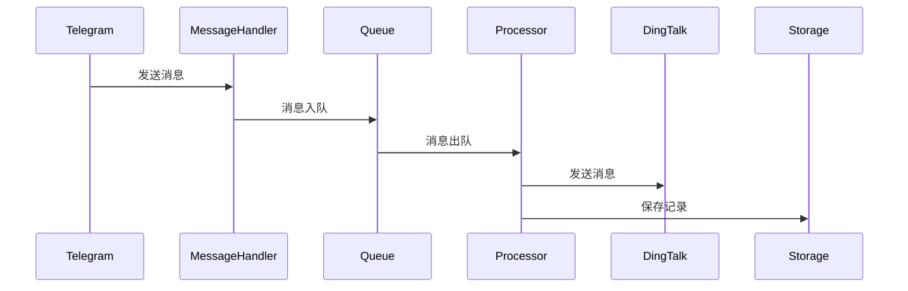
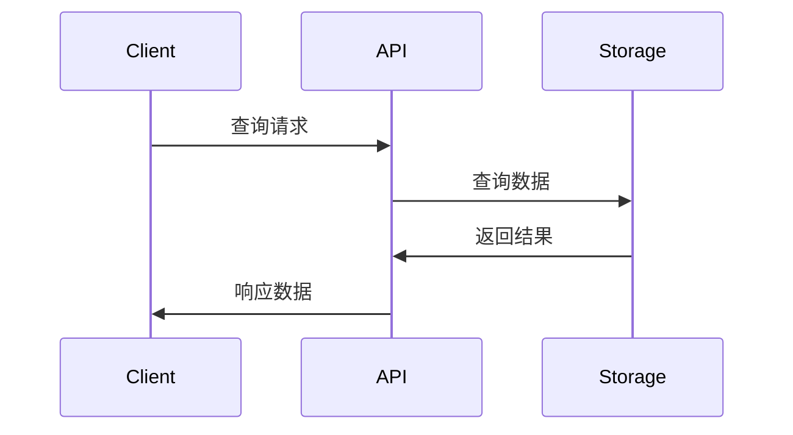
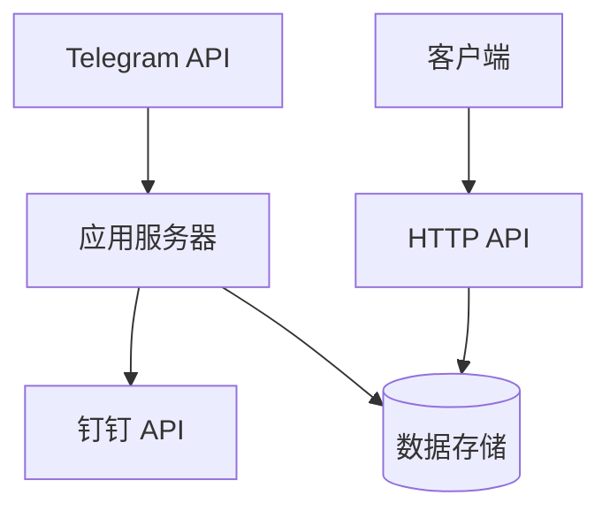

# 系统架构设计

## 整体架构



## 核心组件

### 1. 消息处理器 (MessageHandler)
- 负责接收 Telegram 消息
- 消息格式化和预处理
- 消息入队
- 错误处理和重试机制

### 2. 消息队列 (Queue)
- 支持内存队列和 LevelDB 持久化队列
- 消息持久化存储
- 失败消息重试
- 队列状态监控

### 3. 存储层 (Storage)
- 聊天记录持久化
- 支持按时间、用户查询
- 支持导出功能
- 数据备份和恢复

### 4. HTTP API
- RESTful 接口
- 聊天记录查询
- 数据导出
- 系统监控

### 5. 指标收集 (Metrics)
- 队列状态监控
- 性能指标收集
- 系统运行状态
- 支持 HTTP 和文件输出

## 数据流

1. 消息接收流程


2. 查询流程


## 配置结构

```yaml
telegram:
  token: "bot_token"
  chat_ids: [123456789]

dingtalk:
  webhook_url: "https://oapi.dingtalk.com/robot/send"
  secret: "your_secret"

log:
  level: "debug"
  file: "/var/log/tg-forward/main.log"
  max_size: 100
  max_files: 5

queue:
  type: "leveldb"
  path: "/var/lib/tg-forward/queue"

retry:
  max_attempts: 3
  interval: 60

metrics:
  enabled: true
  interval: 60
  output_file: "/var/log/tg-forward/metrics.json"
  http:
    enabled: true
    port: 9090
    path: "/metrics"
```

## 部署架构

